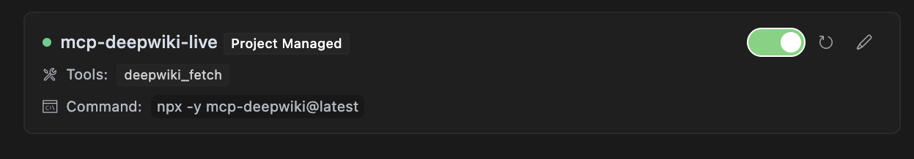

# Nowledge MCP Server

This is the **official Nowledge MCP Server**

It takes a web URL via MCP, crawls all relevant pages, converts them to Markdown, and returns either one document or a list by page.

## Features

- 🌐 **Web-wide Fetching**: Fetches content from any public web URL
- 🧹 **HTML Sanitization**: Strips headers, footers, navigation, scripts, and ads
- 🔗 **Link Rewriting**: Adjusts links to work in Markdown
- 📄 **Multiple Output Formats**: Get one document or structured pages
- 🚀 **Performance**: Fast crawling with adjustable concurrency and depth
- **NLP**: Search by library name or keyword

## Usage

Prompts you can use:

```
nowledge fetch how can i use gpt-image-1 with "vercel ai" sdk
```

```
nowledge fetch how can i create new blocks in shadcn?
```

```
nowledge fetch i want to understand how X works
```

Fetch complete Documentation (Default)
```
use nowledge https://some-website.com/shadcn-ui/ui
use nowledge multiple pages https://some-website.com/shadcn-ui/ui
```

Single Page
```
use nowledge fetch single page https://some-website.com/tailwindlabs/tailwindcss/2.2-theme-system
```

Get by shortform
```
use nowledge fetch tailwindlabs/tailwindcss
```

```
nowledge fetch library

nowledge fetch url
nowledge fetch <name>/<repo>

nowledge multiple pages ...
nowledge single page url ...
```

## Cursor

Add this to `.cursor/mcp.json` file.

```
{
  "mcpServers": {
    "mcp-nowledge": {
      "command": "npx",
      "args": ["-y", "mcp-nowledge@latest"]
    }
  }
}
```



### MCP Tool Integration

The package registers a tool named `nowledge_fetch` that you can use with any MCP-compatible client:

```json
{
  "action": "nowledge_fetch",
  "params": {
    "url": "https://some-website.com/user/repo",
    "mode": "aggregate",
    "maxDepth": "1"
  }
}
```

#### Parameters

- `url` (required): The starting URL of the website or repository
- `mode` (optional): Output mode, either "aggregate" for a single Markdown document (default) or "pages" for structured page data
- `maxDepth` (optional): Maximum depth of pages to crawl (default: 10)

### Response Format

#### Success Response (Aggregate Mode)

```json
{
  "status": "ok",
  "data": "# Page Title\n\nPage content...\n\n---\n\n# Another Page\n\nMore content...",
  "totalPages": 5,
  "totalBytes": 25000,
  "elapsedMs": 1200
}
```

#### Success Response (Pages Mode)

```json
{
  "status": "ok",
  "data": [
    {
      "path": "index",
      "markdown": "# Home Page\n\nWelcome to the repository."
    },
    {
      "path": "section/page1",
      "markdown": "# First Page\n\nThis is the first page content."
    }
  ],
  "totalPages": 2,
  "totalBytes": 12000,
  "elapsedMs": 800
}
```

#### Error Response

```json
{
  "status": "error",
  "code": "FETCH_FAIL",
  "message": "Failed to fetch content from the web"
}
```

#### Partial Success Response

```json
{
  "status": "partial",
  "data": "# Page Title\n\nPage content...",
  "errors": [
    {
      "url": "https://some-website.com/user/repo/page2",
      "reason": "HTTP error: 404"
    }
  ],
  "totalPages": 1,
  "totalBytes": 5000,
  "elapsedMs": 950
}
```

### Progress Events

When using the tool, you'll receive progress events during crawling:

```
Fetched https://some-website.com/user/repo: 12500 bytes in 450ms (status: 200)
Fetched https://some-website.com/user/repo/page1: 8750 bytes in 320ms (status: 200)
Fetched https://some-website.com/user/repo/page2: 6200 bytes in 280ms (status: 200)
```

## Local Development - Installation

### Local Usage

```
{
  "mcpServers": {
    "mcp-nowledge": {
      "command": "node",
      "args": ["./bin/cli.mjs"]
    }
  }
}
```

### From Source

```bash
# Clone the repository
git clone https://github.com/instructa/nowledge.git
cd nowledge

# Install dependencies
npm install

# Build the package
npm run build
```

#### Direct API Calls

For HTTP transport, you can make direct API calls:

```bash
curl -X POST http://localhost:3000/mcp \
  -H "Content-Type: application/json" \
  -d '{
    "id": "req-1",
    "action": "nowledge_fetch",
    "params": {
      "url": "https://some-website.com/user/repo",
      "mode": "aggregate"
    }
  }'
```

## Configuration

### Environment Variables

- `NOWLEDGE_MAX_CONCURRENCY`: Maximum concurrent requests (default: 5)
- `NOWLEDGE_REQUEST_TIMEOUT`: Request timeout in milliseconds (default: 30000)
- `NOWLEDGE_MAX_RETRIES`: Maximum retry attempts for failed requests (default: 3)
- `NOWLEDGE_RETRY_DELAY`: Base delay for retry backoff in milliseconds (default: 250)

To configure these, create a `.env` file in the project root:

```
NOWLEDGE_MAX_CONCURRENCY=10
NOWLEDGE_REQUEST_TIMEOUT=60000
NOWLEDGE_MAX_RETRIES=5
NOWLEDGE_RETRY_DELAY=500
```

## Docker Deployment (Untested)

Build and run the Docker image:

```bash
# Build the image
docker build -t mcp-nowledge .

# Run with stdio transport (for development)
docker run -it --rm mcp-nowledge

# Run with HTTP transport (for production)
docker run -d -p 3000:3000 mcp-nowledge --http --port 3000

# Run with environment variables
docker run -d -p 3000:3000 \
  -e NOWLEDGE_MAX_CONCURRENCY=10 \
  -e NOWLEDGE_REQUEST_TIMEOUT=60000 \
  mcp-nowledge --http --port 3000
```

## Development

```bash
# Install dependencies
pnpm install

# Run in development mode with stdio
pnpm run dev-stdio

# Run tests
pnpm test

# Run linter
pnpm run lint

# Build the package
pnpm run build
```

## Troubleshooting

### Common Issues

1. **Permission Denied**: If you get EACCES errors when running the CLI, make sure to make the binary executable:
   ```bash
   chmod +x ./node_modules/.bin/mcp-nowledge
   ```

2. **Connection Refused**: Make sure the port is available and not blocked by a firewall:
   ```bash
   # Check if port is in use
   lsof -i :3000
   ```

3. **Timeout Errors**: For large repositories, consider increasing the timeout and concurrency:
   ```
   NOWLEDGE_REQUEST_TIMEOUT=60000 NOWLEDGE_MAX_CONCURRENCY=10 npx mcp-nowledge
   ```

## Contributing

We welcome contributions! Please see [CONTRIBUTING.md](CONTRIBUTING.md) for details.

## License

MIT

## Links

- GitHub: [instructa/nowledge](https://github.com/instructa/nowledge)
- X/Twitter: [@kregenrek](https://x.com/kregenrek)
- Bluesky: [@kevinkern.dev](https://bsky.app/profile/kevinkern.dev)

## Courses
- Learn Cursor AI: [Ultimate Cursor Course](https://www.instructa.ai/en/cursor-ai)
- Learn to build software with AI: [instructa.ai](https://www.instructa.ai)

## See my other projects:

* [AI Prompts](https://github.com/instructa/ai-prompts/blob/main/README.md) - Curated AI Prompts for Cursor AI, Cline, Windsurf and Github Copilot
* [codefetch](https://github.com/regenrek/codefetch) - Turn code into Markdown for LLMs with one simple terminal command
* [aidex](https://github.com/regenrek/aidex) A CLI tool that provides detailed information about AI language models, helping developers choose the right model for their needs.
